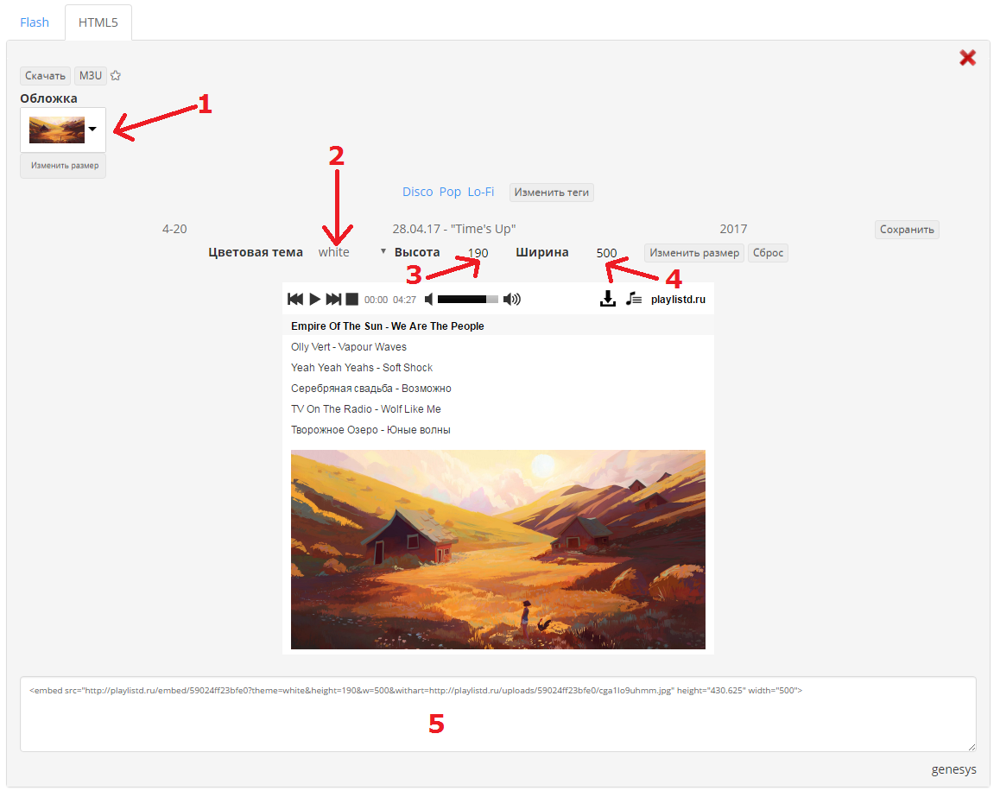

# **Гайдлайны**
### **по операциям с сайтом**
___

### Содержание

1. [Добавление пользователя](#Добавление-пользователя)
2. [Добавление плейлиста](#Добавление-плейлиста)

___

#### Добавление пользователя
 
 Вам потребуется выполнить следующие шаги:
 1. В [`_config.yml`](_config.yml) в корне сайта (это наш основной конфиг-файл) внутрь секции `defaults` добавить два элемента:
 	1. Путь к постам (плейлистам) пользователя.
        ```yaml
        - scope:
            path: "%login%/_posts"
          values:
            author: "%login%"
        ```
	2. Путь к спиcку (индексу) постов пользователя (страница с заблюренными квадратами).
        ```yaml
        - scope:
            path: "%login%"
          values:
            author: "%login%"
            layout: "posts_index"
            permalink: "/%login%/"
        ```
	В обоих случаях вместо `%login%` нужно вписать *логин* пользователя. Логин не должен содержать пробелы и прочие символы, кодируемые в URL, чтобы избежать непотребства при копипасте ссылок.
    
2. В файл `_data/authors.yml` добавить элемент с описанием нового пользователя
    ```yaml
    %login%:
      name: %name%
    ```
    где `%login%` - это логин из `_config.yml`, а `%name%` - *отображаемое* имя пользователя. Оно не будет фигурировать в ссылках, поэтому использование пробелов и тому подобного не возбраняется. По логину автора, хранящемуся в `_config.yml`, Jekyll найдет элемент с описанием автора внутри `authors.yml`.

3. Создать следующие каталоги и файлы (пути даны относительно корня):
	1. Каталог `%login%/_posts` - для хранения постов пользователя
	2. Файл `%login%/posts_index.html` - для страницы со списком постов пользователя. Этот файл должен иметь строго следующее содержание:
        ```
        ---
        ---
        ```
		Эти две строчки - все, что нужно, чтобы Jekyll создал страницу с индексом.


#### Добавление плейлиста


Плейлист представляет собой HTML-файл с фронт-маттером (мета-информацией о странице, которую обрабатывает Jekyll) и контентом.

[Типичный файл поста](gene/_posts/2017-04-07-bit-farewell.html) выглядит так:
```html
---
title: Bit Farewell

cover: http://playlistd.ru/uploads/58e6922e040f9/cvni7lzfjaw.jpg
track_count: 7
duration: "45:10"
---

<embed src="https://playlistd.ru/embed/58e6922e040f9?theme=white&height=210&w=500&withart=https://playlistd.ru/uploads/58e6922e040f9/cvni7lzfjaw.jpg" height="600.625" width="500">
```

Разберем его по частям.

Данные между двумя строками `___` в начале файла - это [*front matter*](https://jekyllrb.com/docs/frontmatter/) поста. Во фронт-маттере только один обязательный параметр - `title`, то есть название плейлиста.
Остальные параметры не считаются обязательными, но мне бы очень хотелось, чтобы вы их использовали:
- cover - URL обложки плейлиста;
- track_count - число треков в листе (используется в квадратах индекса);
- duration - длительность всего листа. Строка формата `({часы}:){минуты}:{секунды}`.

После фронт-маттера следует контент. 

Здесь стоит остановиться и рассказать, как, собственно, создается плейлист. Итак,

##### Гайдлайны по созданию плейлиста

Для создания листов мы используем сервис [playlistd.ru](http://playlistd.ru). Детально описывать работу с ним я не буду, остановлюсь на главном, а именно - генерации тега для встраивания готового плейлиста на другие (то есть наш) сайт.

На рисунке вы видите экран настройки плейлиста. Снизу находится кнопка "Редактировать плейлист" (не вошла в кадр), по нажатию на которую можно изменить порядок треков в листе, а также переименовать их.

Нас же интересуют четыре параметра, влияющие на конечный вид встроенного листа:
1. Обложка. Картинка, которая будет (или не будет, если вы поленитесь ее добавить) отображаться под списком треков и внутри квадрата плейлиста в индексе пользователя. По нажатию на поле откроется список с загруженными для листа картинками. Сам процесс загрузки несложен и на нем я останавливаться не буду. _Подсказка: ссылка на обложку появится в поле с тегом `<embed>` в атрибуте `src`. Для указания URL обложки во фронт-маттере поста рекомендуется использовать именно эту ссылку._
2. Цветовая тема. Мы используем "White".
3. Высота. Высота контейнера списка треков, иными словами - расстояние от кнопок управления листом до обложки. Не регламентирована, но старайтесь не делать из поста макаронину.
4. Ширина. В соответствии с текущим дизайном - 500 (пикселей).

После того, как все параметры установлены, нажмите "Изменить размер". В поле `5` появится embed-тег для вставки листа в страницу поста.

Таким образом, контент поста - это тег `<embed>` с адресом плейлиста.

**_Важно: Github Pages не позволяет загружать контент кроме как через HTTPS._**

Поэтому, прежде чем коммитить пост в репозиторий, нужно подкорректировать тег `<embed>` плейлиста. Замените протоколы всех ссылок внутри атрибута `src` (то есть ссылки на сам плейлист и на обложку) c `http` на `https`.

___
Кажется, это все, что может потребоваться. Конец.
